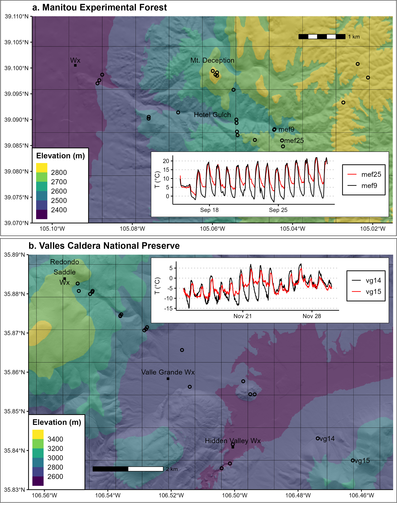
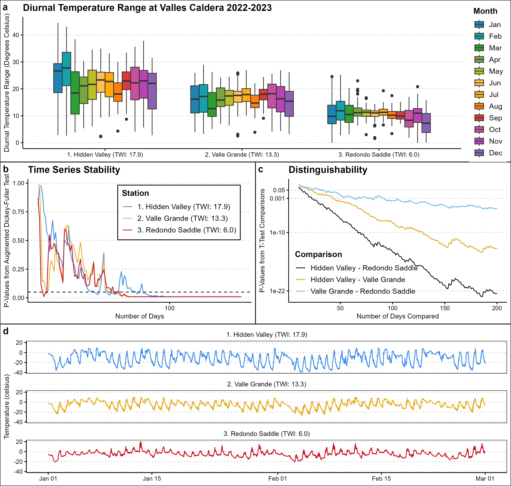

# Data and code for "Diurnal temperature range drives understory plant community composition in micro-climatically complex temperate montane forests"

## Study area

## Diurnal temperature range is stable

## DTR Drives fine-scale community composition and has a negative relationship with species richness

## DTR can be modelled with elevation and topographic wetness index

